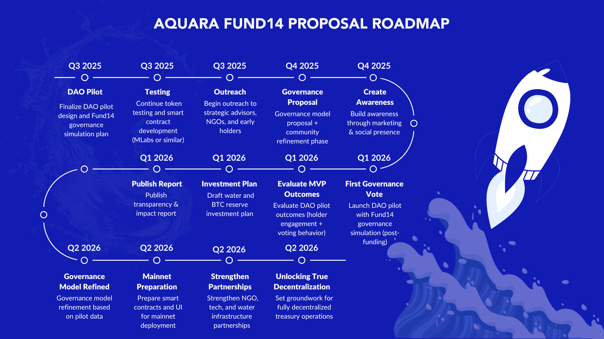

# aquara-dao
Aquara is a decentralized water fund and governance layer building sustainable water management through tokenized incentives and DAO logic. Fund14 Catalyst proposal and planning repo.

### 🗳️ Fund14 Catalyst Proposal
This repository also serves as the official proposal repository for Aquara’s Fund14 Catalyst submission.

**This GitHub repo contains:**
- Our Fund14 Catalyst proposal
- Our preliminary governance model outlines
- Tokenomics and roadmap
- DAO simulation plans
- Core documents and assets

## 🔗 Start Here

Get a quick overview of Aquara’s mission, architecture, and vision.

- [🌐 Visit our website](https://aquara.io)
- [🧭 Start Here Overview (short orientation doc)](https://drive.google.com/file/d/1zaSm0HRqofiqqE2vp_2DebN9n7Hu7M7S/view?usp=sharing)
- [📄 Litepaper (summary vision)](https://drive.google.com/file/d/13TNf74iXeh9C9j7FEjtnZ0IoVR_I0A_Z/view?usp=sharing)
- [📘 Full Whitepaper (PDF)](https://drive.google.com/file/d/1EJeiwv_9_CiSVi_LokZL6-zvBADQoVB3/view?usp=sharing)

## 💸 Fund14 Proposal

- [📄 Fund14 Proposal (Markdown)](proposal.md)
- [💰 Budget Breakdown (PDF)](./assets/Aquara_Catalyst_F14_Budget.pdf)
- [🧪 DAO MVP Pilot Governance Plan](./dao-mvp-pilot-governance.md)  
  A detailed plan for the Aquara MVP, governance pilot, and DAO simulation approach for Fund14.

## 📊 DAO Design & Tokenomics

- [🧠 Preliminary Governance Mode](https://www.aquara.io/_files/ugd/6d59ef_db50001936c6464db4ebafb342d2f41f.pdf)
- [🪙 Tokenomics & Treasury](https://www.aquara.io/_files/ugd/6d59ef_7a799203d6df4720add4f3ba11807382.pdf)

## 🗺️ Launch Strategy

- [📅 Launch Blueprint (2025–2027)](https://drive.google.com/file/d/1WBg79isRDq532cxkcSPcBF3-ZAY440Pf/view) – Internal-facing strategic roll-out

## 🗺️ Aquara Roadmap (Q3 2025 – Q2 2026)

This timeline reflects what we aim to achieve with Fund14 support.  
For our full public roadmap, visit [aquara.io/roadmap](https://www.aquara.io/roadmap).

## 🎬 Project Videos

- [🔹 Founder Introduction (2 min)](https://www.youtube.com/watch?v=ChHVROUFp8g)
  A personal message from the founder about Aquara's mission and long-term vision.

- [🔹 Animated Explainer (2 min)](https://www.youtube.com/watch?v=ZFZ48x9umt8)
  Quick visual summary of Aquara’s model, token, DAO structure, and water governance goals.

## 🧪 Experimental / Planning Folders

These folders will contain early-stage work and planning materials for Aquara's longer-term development roadmap.

- `/designs/` – UI mockups and early interface concepts  
- `/research/` – Papers, NGO evaluation notes, references  
- `/contracts/` – Placeholder for smart contract specs (future)
